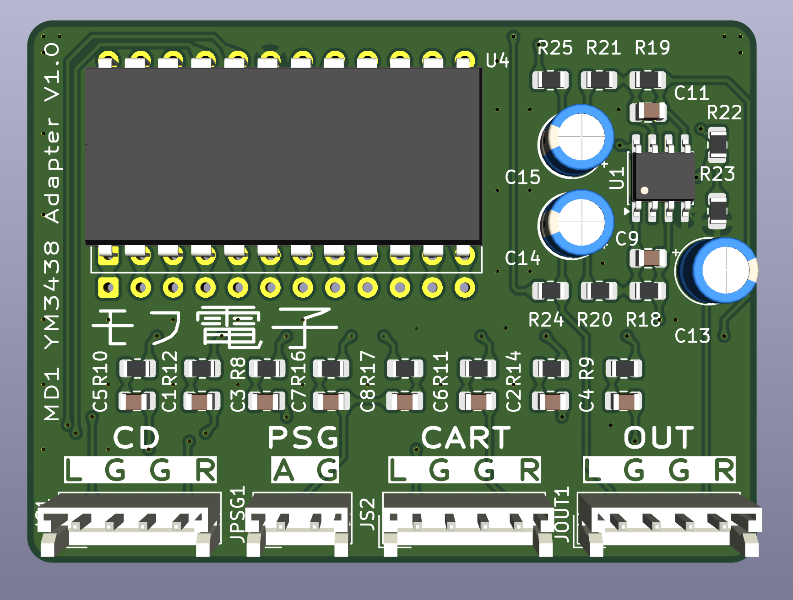

# MD YM3438 Adapter

## Status

First rev PCB worked after correcting a few errors. The second rev has been reduced in size

## Overview
This adapter facilitates the install of a YM3438 (OPN2C) in a Sega Mega Drive or Genesis console. Glue logic is present to solve status read bugs that invoke different behavior between the original YM2612 and the CMOS YM3438. In addition, a mixing and buffering circuit (courtesy of [the open source Triple Bypass PCB](https://github.com/tianfeng33/triple-bypass-Version-2)) to both handle the new YM3438 and also provide clean mixing for other signals. The buffer circuit also has provisions to output audio to the original signal path, so that the mono audio output and the headphone jack both work as designed.

These instructions were written using a Japanese VA0 unit as a reference, but principally can apply to any Megadrive or Genesis with a YM2612 in it.

## Kit assembly

### Parts List

All SMD capacitors and resistors are of size 0805 (2012 metric).

- 2x 12 machine pin header strips
- YM3438 IC (DIP24)
- 1x 74HCT08 (SOIC-8)
- TL972 or similar dual op-amp
- 2x 47uF 50V electrolytic capacitor
- 1x 10uf 16V electrolytic capacitor
- 2x 10uF/16V SMD capacitor
- 6x 1uF/16V SMD capacitor
- 2x 150pF/50V SMD capacitor
- 2x 330 ohm SMD resistor
- 4x 10k ohm SMD resistor
- 2x 100k ohm SMD resistor
- 6x 210k ohm SMD resistor
- 2x 300k ohm SMD resistor

### Component Locations

| Designator         | Part            |
|--------------------|-----------------|
| C1, C2             | 10uF / 16V      |
| C3 - C8            | 1uF / 16V       |
| C9, C11            | 150pF / 50V     |
| C13                | 10uF / 16V      |
| C14, C15           | 47uF / 50V      |
| R8-R11, R16, R17   | 210k            |
| R12, R14, R24, R25 | 100k            |
| R18, R19           | 300k            |
| R20, R21           | 330             |
| R22, R23           | 10k             |
| U1                 | TL972           |
| U3                 | 74HCT08         |
| U4                 | YM3438 (OPN2C)  |

### Motherboard Preparation

A few changes will be made to the Megadrive motherboard.

Remove the YM2612 and set it aside.

Remove capacitors C40, C41, C42, C43, C44, C61, and C62.

Replace C41 and and C43 with wire links or zero ohm resistors.

Remove R34 and R37. As the MD does not have underside silkscreen you may identify these by tracing from the positive side of C40, where the two resistors are written with code 513.

Remove R53 and R43. Like R34 and R37, these are likely unmarked. They are 2.2k resistors between C41/C43 and ground.

Remove C45-C48. These are surface mount resistors near the resistors from before.

At this point, the new audio will enter through what used to be the MOL and MOR pins for the OPN2, at pins 21 and 20 respectively. The mixed stereo signals enter the original mixing circuit alone, where it then enters the headphone amp as well as the mono mixdown for the CXA-1145.

### Board Assembly

Place the adapter PCB on top of the pin strips using the *bottom set* of pins. Solder the pin strips in place from the top side.

Now, install the 74HCT08 (U3), then install the YM3438 (U4) on the *top set* of pins that remain open from before.

I recommend installing the op-amp (U1) next, followed by all of the chip resistors and capacitors. Then, the electrolytic capacitors follow.

Finally, run wires to various points on the motherboard in accordance with this table:

| Pad           | Signal    | Motherboard location      |
|---------------|-----------|---------------------------|
| PSG           | PSG audio | C40 (negative pin)        |
| SL1           | Exp. L    | C42 (negative pin)        |
| SR1           | Exp. R    | C44 (negative pin)        |
| SL2           | Cart L    | C61 (negative pin)        |
| SR2           | Cart R    | C62 (negative pin)        |

With everything installed, it's up to you how you want to route the audio out. The 'OUT' connector is present so you may run a stereo output to the back of the console, or to some other connector of your choosing.

The newly amplified audio is routed through the original signal path for the OPN2 that we replaced. So long as the other audio sources are removed from this path, and we bypass a few components, the original headphone jack and mono output can be made to work as they did in the original.

### Upgrade op-amp

Remove IC14 (LM324) and recycle it as it's totally ass and put another op amp in its place. Courtesy of [consolemods](https://consolemods.org/wiki/Genesis:Audio_Circuit_Mod) many options exist, but I'll quote TL974I or MC34074 as the first options on their list.

## Troubleshooting

### Headphones / Mono too loud/quiet

I didn't know what resistor values would be appropriate when throwing this board together. Try changing R24 and R25 for higher or lower values according to the situation.

