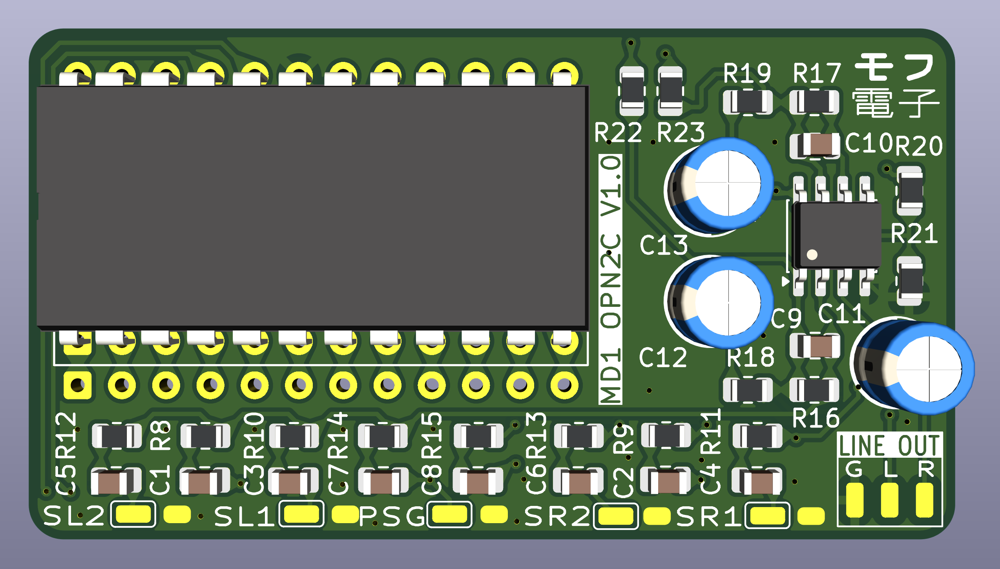
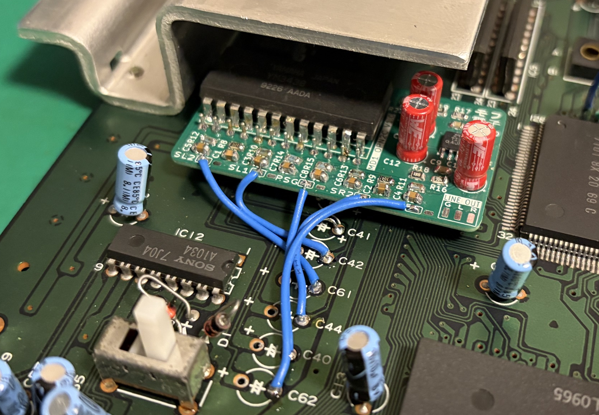
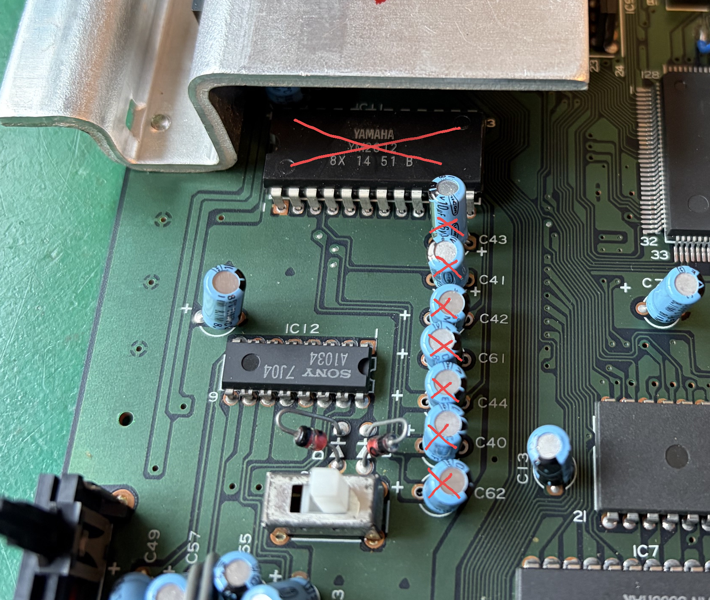
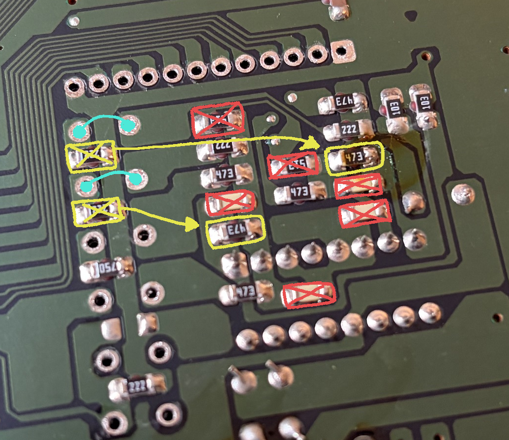
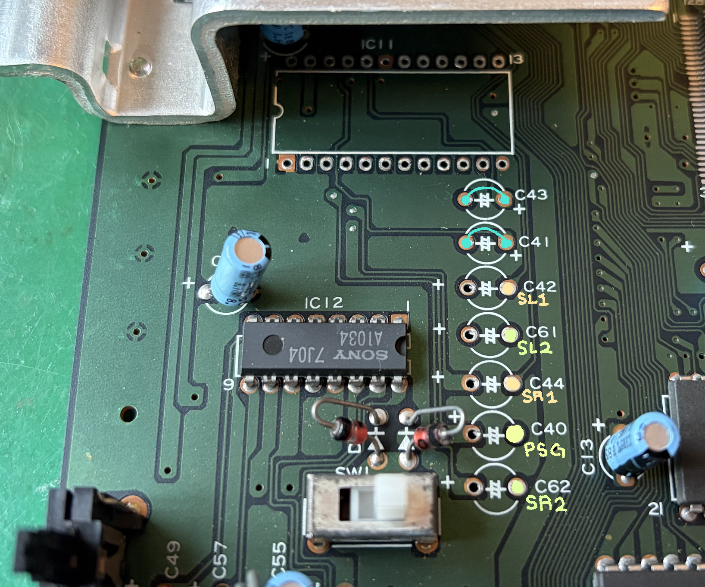

# MD用YM3438アダプター・MD YM3438 Adapter

メガドライブ（初代）VA0-VA6は互換です。 ジェネシス２のVA3でも動くかもしれませんが、未確認なので一応保証ができません。
Compatible with Genesis 1 / Megadrive 1 VA0-VA6. Genesis 2 VA3 (with discrete YM2612) may work, but has not been tested, and I cannot provide installation instructions at this time. 

# 概要・Overview
このアダプターでメガドライブ初代はYM3438(OPN2C)が対応できるようになります。　元々の音源のステータスレジスターの読み込みの違いを解決するとジックがついています。　その上[オープンソースのとリップルバイパス](https://github.com/tianfeng33/triple-bypass-Version-2))より綺麗な音源のミクサーとバッファーがついていて、元々のヘッドホンも専用ライン出力が使えるようになります。

メガドラVA0の基板を参考しながら書いたんですが、基本的にすべての初代の基板は互換はずです。

This adapter facilitates the install of a YM3438 (OPN2C) in a Sega Mega Drive or Genesis console. Glue logic is present to solve status read bugs that invoke different behavior between the original YM2612 and the CMOS YM3438. In addition, a mixing and buffering circuit (courtesy of [the open source Triple Bypass PCB](https://github.com/tianfeng33/triple-bypass-Version-2)) to both handle the new YM3438 and also provide clean mixing for other signals. The buffer circuit also has provisions to output audio to the original signal path, so that the mono audio output and the headphone jack both work as designed.

These instructions were written using a Japanese VA0 unit as a reference, but principally can apply to any Megadrive or Genesis with a YM2612 in it.

# 設置・Installation

## マザーの修正・Motherboard Preparation

マザーに付ける前に修正が必要です．

With the adapter unit ready, some work must be done to the Megadrive motherboard.

YM2612を外して、どこか保存しします。（依頼要らないけど捨てないでください！）　下の縦列のコンデンサーも外しましょう。(C40, C41, C42, C43, C44, C61, C62)

Desolder and remove the YM2612, and the column of capacitors below it (C40, C41, C42, C43, C44, C61, and C62).

底面に赤く示している部品を外します。 (R34, R37, R40, R41, C45, C46, C47, C48)。　右の黄色いやつを外して、左のバツが付いている黄色い部品をその位置に移動します (R53/R43, R40/R41)。　C41とC43の穴にリンクを入れてください。

下面に印刷がないので下の絵を参考してください。

On the underside, remove the components marked in red (R34, R37, R40, R41, C45, C46, C47, C48). Remove the components marked in yellow (R53 and R43) and move them to the spot marked in yellow (R40 and R41). Install a link between the two pins of capacitors C41 and C43.

As there is no silkscreen on the underside of most revisions, the diagram will be a helpful reference. 

新しいミックスされた音声は元々のFM音源の端子に入ります（21ピンと20ピン）。　そのために元々のヘッドホンもモノの出力が使えます。

The new audio will enter through what used to be the MOL and MOR pins for the OPN2, at pins 21 and 20 respectively. The mixed stereo signals enter the original mixing circuit alone, where it then enters the headphone amp as well as the mono mixdown for the CXA-1145.

### （随意）オペアンプをグレードアップ・Optional op-amp Upgrade

必要ではないんですが、モノの出力が使用なら元々のLM324(IC14) をよりいい物に交換したほうがマシです。　色々が使えますが、とりあえず[consolemods](https://consolemods.org/wiki/Genesis:Audio_Circuit_Mod)よりおすすめはTL974IかMC34074です (DIP8).

It is optional but recommended to remove the original LM324 op-amp (IC14) that buffers mono audio output with a better unit. Courtesy of [consolemods](https://consolemods.org/wiki/Genesis:Audio_Circuit_Mod) many options exist, but I'll quote TL974I or MC34074 as the first options on their list. This is a DIP8 package.

## 基板の付け方・Installation in Megadrive

先の準備を完全似できたか確認しておいてください。

Please be sure you have completed the Motherboard Preparation steps first.

YM2612の位置にYM3438のアダプターを入れて、下面にハンダ付けます。　上面に5本の配線が必要です。　下の表を参考して

Place the assembled YM3438 adapter unit in the position that once held the original YM2612, and solder it in place on the underside. On the top, five wires are necessary to feed in the various audio signals that compliment the FM sound source. The table below describes the positions shown in the annotated picture below.

| 信号Signal | 出所Location |
|------------|--------------|
| PSG        | C40 (-)      |
| SL1        | C42 (-)      |
| SR1        | C44 (-)      |
| SL2        | C61 (-)      |
| SR2        | C62 (-)      |

これで、どうやって出力を本体外に出すか自分の決まりです。　もしヘッドホンの端子が十分でしたらここまでストップしても大丈夫です。　しかし、ヘッドホンのアンプより直接LINE出力したらノイズが少なくなるので、LINEの出力はおすすめです。

アダプターにOUTのパッドがあります。　そこに配線付けて端子に繋げたらLINEの出力が可能です。

With everything installed, it's up to you how you want to route the audio out. If the headphone jack alone is adequate, you may stop here. However, I recommend a dedicated line out connection, as the headphone amp does introduce some noise.

The 'OUT' pads is present so you may run a stereo output to the back of the console, or to some other connector of your choosing. Stereo audio will be present via the headphone jack, and mono audio will be delivered out of the rear A/V connector.

# 手作り説明・Kit Assembly Guide

この部分は部品で０から作る方用です。

This section is for hand-assembling the adapter from scratch.

## 部品表・Parts List

すべてのSMD部品は2012サイズになります。

All SMD capacitors and resistors are of size 0805 (2012 metric).

- 2 x 12 machine pin header strips or 24 pin DIP header
- 1 x YM3438 IC (DIP24)
- 1 x 74HCT08 (SOIC-14)
- 1 x TL972 or similar dual op-amp (SOIC-8)
- 1 x Optional TL972 or similar dual op-amp (DIP-8)
- 2 x 47uF 50V electrolytic capacitor
- 1 x 10uf 16V electrolytic capacitor
- 2 x 10uF/16V SMD capacitor
- 6 x 1uF/16V SMD capacitor
- 2 x 150pF/50V SMD capacitor
- 2 x 330 ohm SMD resistor
- 4 x 10k ohm SMD resistor
- 4 x 100k ohm SMD resistor
- 6 x 210k ohm SMD resistor
- 2 x 300k ohm SMD resistor

## 作り方・Assembly Process

表の隠折に部品を付けます。
Populate the components as labeled:

| Designator         | Part            |
|--------------------|-----------------|
| C1-C2              | 10uF / 16V      |
| C3-C8              | 1uF / 16V       |
| C9-C10             | 150pF / 50V     |
| C11                | 10uF/16V TH     |
| C12-C13            | 10uF / 16V TH   |
| C14-C15            | 47uF / 50V      |
| R8-R9, R22-R23     | 100k            |
| R10-R13, R14-R15   | 210k            |
| R16-R17            | 300k            |
| R20-R21            | 10k             |
| R18-R19            | 330             |
| U1                 | TL972           |
| U3                 | 74HCT08         |
| U4                 | YM3438 (OPN2C)  |

遅住めは、最初ICを付けたらSMDのやつを付けて終えます。それから下向けのピンを付けて、上面からYM3438をハンダ付けます。

I recommend installing the two SMT ICs (TL972 and 74HCT08), followed by the SMT capacitors and resistors, and finally the through-hole parts.

You must install the 74HCT08 and at least the top pin strip before installing the YM3438, or you will not be able to access them. The YM3438 will not sit entirely flat, but this is normal.
